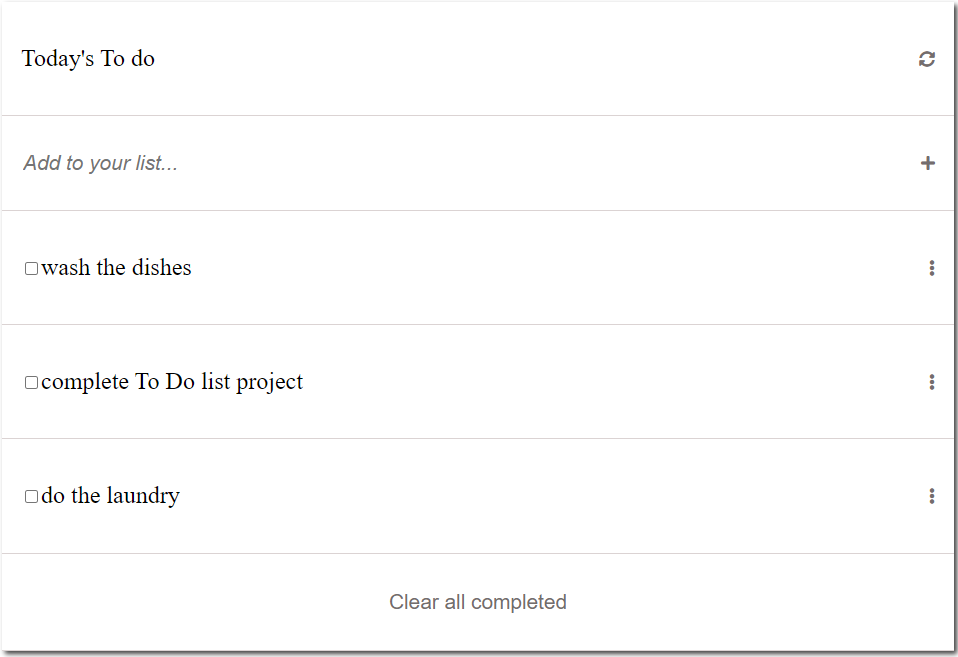

# To-Do-List

To-do list" is a tool that helps to organize your day. It simply lists the things that you need to do and allows you to mark them as complete.

  

## Built With

- HTML
- CSS
- JAVASCRIPT (ES6)
- WEBPACK

## Live Demo

[Live Demo Link](https://chukwuemeka1234.github.io/To-do-list/)

## Getting Started

To get a local copy up and running follow these simple steps.

### Prerequisites

some knowledge on `npm` webpack and ES6

### Setup

- Clone repository
- run `npm start`
### Install

- Node modules
- HtmlWebpackPlugin `npm install --save-dev html-webpack-plugin`
- Load CSS `npm install --save-dev style-loader css-loader`
- Setup local dev server `npm install --save-dev webpack-dev-server`

## Authors

👤 **Author**

- GitHub: [@chukwuemeka1234](https://github.com/chukwuemeka1234)
- Twitter: [@avc_victor](https://twitter.com/@avc_victor)
- LinkedIn: [ani-chukwuemeka](https://linkedin.com/in/ani-chukwuemeka-a65421199/)

## 🤝 Contributing

Contributions, issues, and feature requests are welcome!

## Show your support

Give a ⭐️ if you like this project!

## 📝 License

This project is [MIT](./MIT.md) licensed.